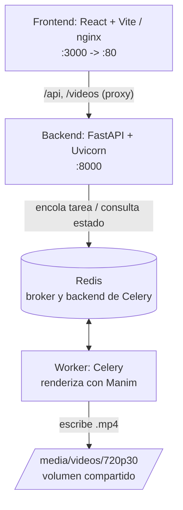

# Manimator USM

Herramienta web para renderizar **animaciones de curvas paramétricas** generadas con [Manim](https://www.manim.community/). El usuario ingresa una curva `f(t)` en LaTeX junto con sus límites `[a, b]`, selecciona las escenas que desea y el sistema genera los videos correspondientes.

Proyecto desarrollado por **Francisco Manríquez Novoa** como parte de su memoria de título y **donado a la comunidad Linux y Open Source USM (LyOSS)** tras su defensa, con el objetivo de mantenerlo vivo y de libre uso para docentes y estudiantes.

La página está pensada para que un **docente** la use en sus clases de curvas paramétricas o un **estudiante** pueda repasar y experimentar por su cuenta con los ejemplos vistos en clases o en textos.

## Agradecimientos

Este proyecto se entrega a la comunidad como una donación:

- A **Francisco Manríquez Novoa**, autor de la herramienta, por compartirla con LyOSS y la comunidad open source.
- A **[chopan050/manimator-usm](https://github.com/chopan050/manimator-usm)**, el repositorio original del que deriva este trabajo y cuya idea y estructura base se retomaron.
- A la **comunidad LyOSS**, por difundir y mantener vivos los principios del software libre dentro de la USM.
- A **Manim** y su comunidad, por poner a disposición un motor de animación matemática tan potente.

## Funcionalidades

- Renderizado asíncrono de curvas paramétricas 2D y 3D.
- Seis escenas animadas: trazado, rotación, derivada (vector velocidad), recta tangente, recta/plano normal y longitud de arco.
- Entrada de curva y límites en notación LaTeX, procesada simbólicamente con SymPy (incluye derivación automática).
- Interfaz bilingüe (español/inglés) con reproducción de video integrada.
- Cache de resultados: los videos ya generados no se vuelven a renderizar.

## Arquitectura

El proyecto es un stack full-stack orquestado con Docker Compose:



Flujo de una petición:

1. El frontend envía `f(t)`, `a`, `b`, las escenas seleccionadas y la configuración al backend.
2. El backend encola una tarea en **Celery** a través de **Redis** y devuelve un `task_id`.
3. El **worker** renderiza cada escena seleccionada con Manim y guarda los `.mp4` en el volumen `media`.
4. El frontend hace *polling* cada 2 segundos a `/status/{task_id}` y muestra los videos a medida que quedan listos.

## Requisitos previos

- Docker y Docker Compose (v2 o superior).

## Puesta en marcha

```bash
docker compose up --build
```

| Servicio  | URL                     |
| --------- | ----------------------- |
| Frontend  | http://localhost:3000   |
| Backend   | http://localhost:8000   |
| API docs  | http://localhost:8000/docs |

Para detener: `docker compose down`.

## Uso

1. Escribir la curva paramétrica en LaTeX, por ejemplo `(\cos(t), \sin(t))`.
2. Definir los límites `a` y `b` (aceptan expresiones como `0` y `2\pi`).
3. (Opcional) Activar **"Usar la misma escala en todos los ejes"** para preservar la relación de aspecto de la curva.
4. Seleccionar las escenas deseadas y pulsar **Renderizar**.
5. Esperar la generación y reproducir los videos en las pestañas.

### Escenas disponibles

| Clave          | Escena                                       |
| -------------- | -------------------------------------------- |
| `tracing`      | Trazado de la curva con punto animado.       |
| `rotation`     | Rotación de 360° (3D).                       |
| `tangentvector`| Derivada y vector velocidad.                 |
| `tangentline`  | Recta tangente.                              |
| `normal`       | Recta normal (2D) o plano normal (3D).       |
| `arclength`    | Longitud de arco (animación lenta).          |

## Stack de tecnologías

| Capa      | Tecnologías                                                            |
| --------- | ---------------------------------------------------------------------- |
| Frontend  | React 19, TypeScript, Vite, Tailwind CSS 4, shadcn/ui + Radix UI, React Compiler |
| Backend   | Python 3.14, FastAPI, Celery, Redis, Manim, SymPy, Uvicorn             |
| DevOps    | Docker, Docker Compose, Nginx                                          |

## Estructura del repositorio

```
.
├── backend/            # API FastAPI, worker Celery y generador de escenas Manim
├── frontend/           # SPA en React + TypeScript + Vite
├── docker-compose.yml  # Orquestación de servicios
└── media/              # Videos generados (volumen compartido, ignorado por git)
```

## Notas y limitaciones conocidas

- La escena de **longitud de arco** es la más costosa y puede tardar varios minutos.
- En la escena normal 3D existe un bug conocido al pasar de un círculo a un cuadrilátero (queda una copia del círculo), documentado en el código.
- El backend asume la ruta `/manim/media` para el directorio de salida; el `Dockerfile` incluye un TODO pendiente para ejecutar como usuario no root.
- Solo se renderiza `720p30` (calidad media de Manim).
- El programa no se comporta bien ante **discontinuidades** de la curva.

## Ideas de extensión

Ideas mencionadas por el autor para seguir desarrollando el proyecto:

- Soporte para **superficies paramétricas**.
- Soporte para **funciones por tramos** o **múltiples funciones a la vez**.
- Corregir el comportamiento en **discontinuidades**.

## Créditos y licencia

Código escrito por **Francisco Manríquez Novoa**, basado en el trabajo original de **[chopan050/manimator-usm](https://github.com/chopan050/manimator-usm)**, con el apoyo de la comunidad **lyoss-usm**.

Este proyecto es de código abierto, publicado para uso educativo y de la comunidad. Si reutilizas o modificas el código, considera dar crédito al autor original y a este repositorio.
